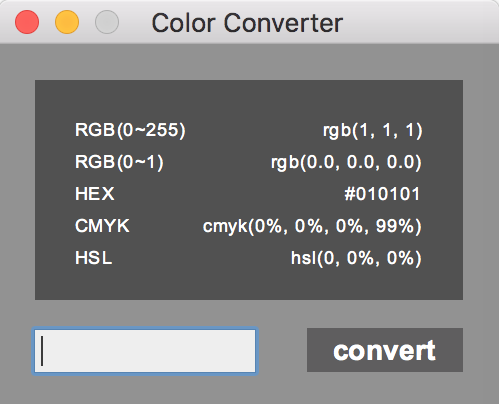

# Color Converter
Simple **tkinter** application. Convert `RGB(0~255)` to `multiple color system (RGB(0~1), HEX, CMKY, HSL)`

## How to use?

### Achieve executable file

#### Generate standlone Mac OS application by yourself:

Required Environments:

* Python 3.x (Avoid calculated error happens on Python 2.x)
* setuptools
* py2app v0.13 (Generated error happened on v0.14, Sep 13 2017)
* PyCharm IDE for editing (Recommended)

Using command line below:

```
python3 setup.py py2app
```

#### Using application directly:

Unzip 'Color Converter.zip', application will be there

### Using GUI



Enter three integer (0~255) separated by `,` as the following format:

```
xxx,xxx,xxx
```

Then hint `return` key or click the `convert` button on the window

## License

Free and Open Source, Feel feel to use and modified it

## Contact

You can contact me via lixphilosophy@gmail.com
